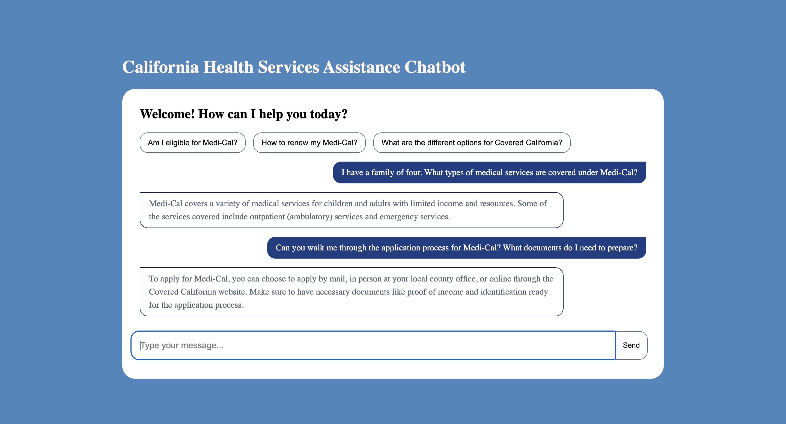

# rag-chatbot

## California Health Services Assistance Chatbot



A chatbot using Retrieval-Augmented Generation (RAG) to provide information about Medi-Cal and Covered California.

Note:
This is a refactored version of a project submitted for the Microsoft Rag Hack 2024. You can find the original submitted project [here](https://github.com/microsoft/RAG_Hack/issues/150).

## Background

Healthcare in the United States can be expensive and complex to navigate. This Retrieval-Augmented Generation (RAG) chatbot focused on California Health Services is built to assist California residents to understand and query their rights and eligibility for programs like Medi-Cal and Covered California. This AI-powered solution aims to:

1. Provide easy access to accurate information about Medi-Cal and Covered California
2. Offer personalized responses and improve accessibility to healthcare information for all California residents
3. Reduce the burden on government resources by automating common inquiries

## Tech Stack

- Frontend: React
- Backend: Node.js with Express
- RAG Implementation: Langchain
- Database: PostgreSQL

## Installation

1. Clone the repository:

   ```bash
   git clone https://github.com/seneyu/rag-chatbot.git
   cd rag-chatbot
   ```

2. Install dependencies for both client and server directories:

   ```bash
   cd client && npm install
   cd ../server && npm install
   ```

3. Set up environment variables:

   - Create a `.env` file in the `server` directory
   - Add your OpenAI API key:

   ```text
   OPENAI_API_KEY=your_api_key_here
   ```

4. This project uses Supabase for storing and retrieving embeddings. Follow these steps to set up your own Supabase instance:

   1. Create a Supabase account at supabase.com
   2. Create a new project in Supabase
   3. Set up your database schema
   4. Generate embeddings:

   - Navigate to /server/createEmbeddings.js
   - Review the `createAndStoreEmbeddings()` function at line 44
   - If you need to generate new embeddings, ensure the function call is uncommented: `createAndStoreEmbeddings()`. Run the script: `node creaetEmbeddings.js`. Note: For this project I keep the files in the `./client/data` directory.
   - If embeddings are already generated, ensure the function call is commented out to prevent accidental recreation. You can skip running this script.

   5. Add Supabase configuration to your `.env` file:

   ```text
   SUPABASE_URL=your_supabase_project_url
   SUPABASE_KEY=your_supabase_api_key
   ```

5. Navigate to the server directory and start the server with:

   ```bash
   cd server
   npm run start
   ```

6. Open your browser and navigate to `http://localhost:5173` (or the port specified by Vite).

## Future Improvements

- Add reference citations to AI's answers
- Language support
- Expand the knowledge base to cover more specific health programs

## Disclaimer

This chatbot utilizes information from the California Health Care Services (HCS) and Covered California websites. While I strive to provide accurate and up-to-date information, some content may not be current. This chatbot is not an official service of HCS or Covered California and should not be considered a substitute for professional advice or assistance.
